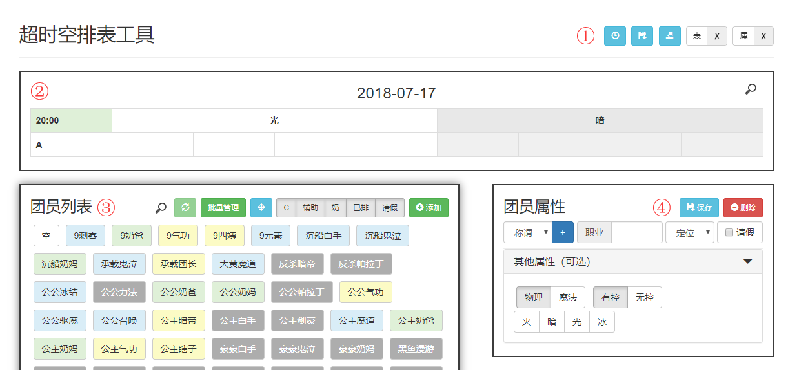

# hyper_schedule
当前版本 0.2.1

本项目为[卢克排表工具](https://github.com/LuHaoPeng/luke_schedule)的分支。

## 功能简介

1. 工具区

    - 第一个按钮是历史排表，点击列表项可以载入排表。
    - 第二个按钮是排表区保存按钮，手动保存排表（团长权限专属）。
    - 第三个按钮可将排表导出成截图，图片可直接复制或保存至本地。
    - 第四个按钮是表格编辑锁，在编辑表格结构时需要先解锁。（锁只是为了截图的时候好看一点，隐藏掉+-按钮，**不影响排表**）
    - 第五个按钮是属性攻击锁，解锁可以查看每个团员的属性方块。（截图时建议加锁）

2. 排表区

    - 将团员直接拖入表格单元格即可排表。
    - 点击右上角`查找`按钮，可以高亮团员。
    - 表中团员可以互相拖拽实现调换位置。

3. 团员区

    - **强烈建议留一个「空」团员用来占位**
    - 点击`查找`，可以查找筛选团员。
    - 点击`刷新`可以重载列表。
    - 点击`批量管理`打开管理面板，在下方选择团员后，点击面板中按钮可以批量请假/销假。
    - 按住`锚点`可以拖动面板。
    - 点击筛选按钮可以隐藏/显示对应分类的团员。
    - 点击`添加`可以新增一个空白团员。
    - 每次`保存`或`删除`团员时，都会自动重载列表。
    - 目前没有「酱油」定位，暂用「辅助」代替，后续看需要增设。

4. 团员属性

    - 先在左侧团员列表选中一个团员，然后可在右侧编辑该团员的属性，编辑完成后**请点击`保存`**。
    - 可选属性可以编辑团员的攻击属性，可以多选。
    - 称谓是团员的昵称，建议2个中文字左右，这是**排重的关键**，在添加前请确认是否已存在。
    - 职业请填写简称，建议3个中文字以内。

5. 其他

    - 操作中遇到权限不足的情况，会提供重新登录的链接。

## 注意事项

- 新增团员时，请先点击`添加`，再点击列表末尾多出来的`新增人员`，然后在右侧属性区编辑属性。
- 修改某一团员属性时，请先点击该团员，**确保属性区读取到了该团员的信息后**，再进行编辑和保存，以免错改了其他团员的属性。
- 活用筛选器和查找框，可以方便眼神不好的人。
- 遇到功能生效异常的情况，请先尝试刷新页面，如未解决，可尝试清除浏览器缓存后重试(Chrome浏览器可在F12控制台设置临时禁用缓存)。

## 更新计划

- [x] 增加团员属性攻击标记，方便调整队伍统一属性。(UPDATE 2018-07-19)

## 更新历史

- 0.2.1(*2018-09-05*): 点击查找按钮会自动选中当前输入文字，方便删除；可远程设置每团间隔（尚未实装到页面）。
- 0.2(*2018-07-19*): 增加团员属性攻击标记，以及全局开关。
- 0.1(*2018-06-19*): 从[luke_schedule](https://github.com/LuHaoPeng/luke_schedule)项目分支而来，发布。